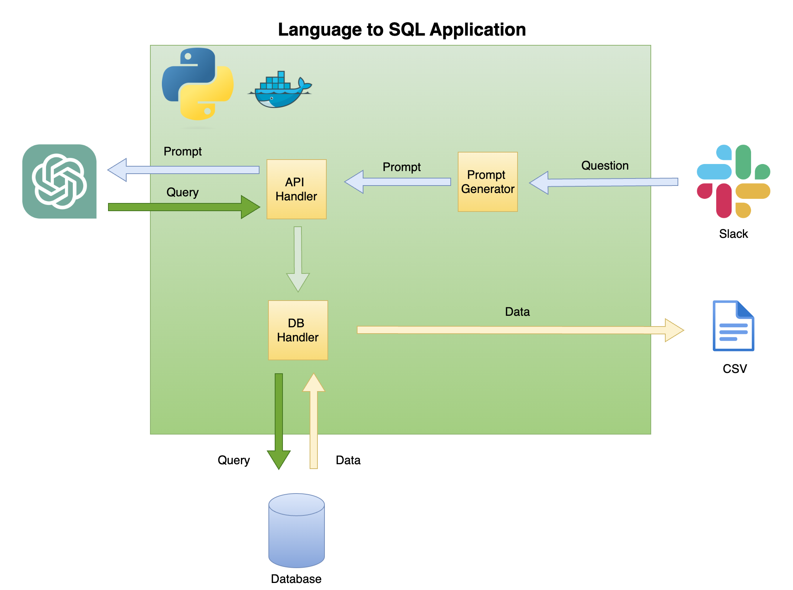
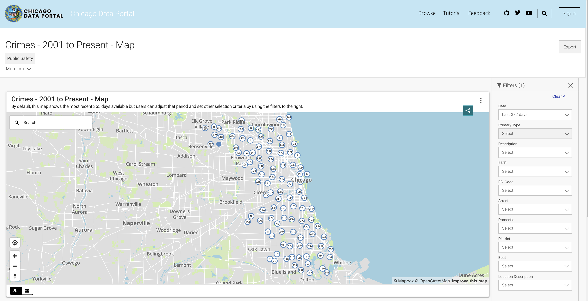
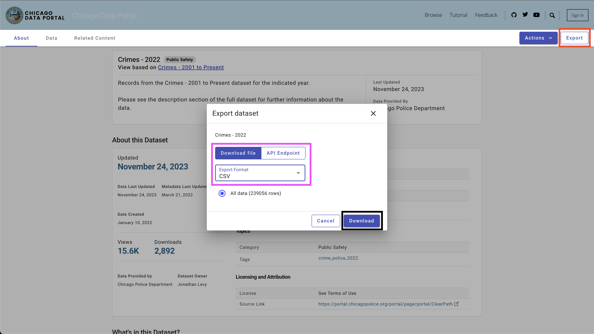
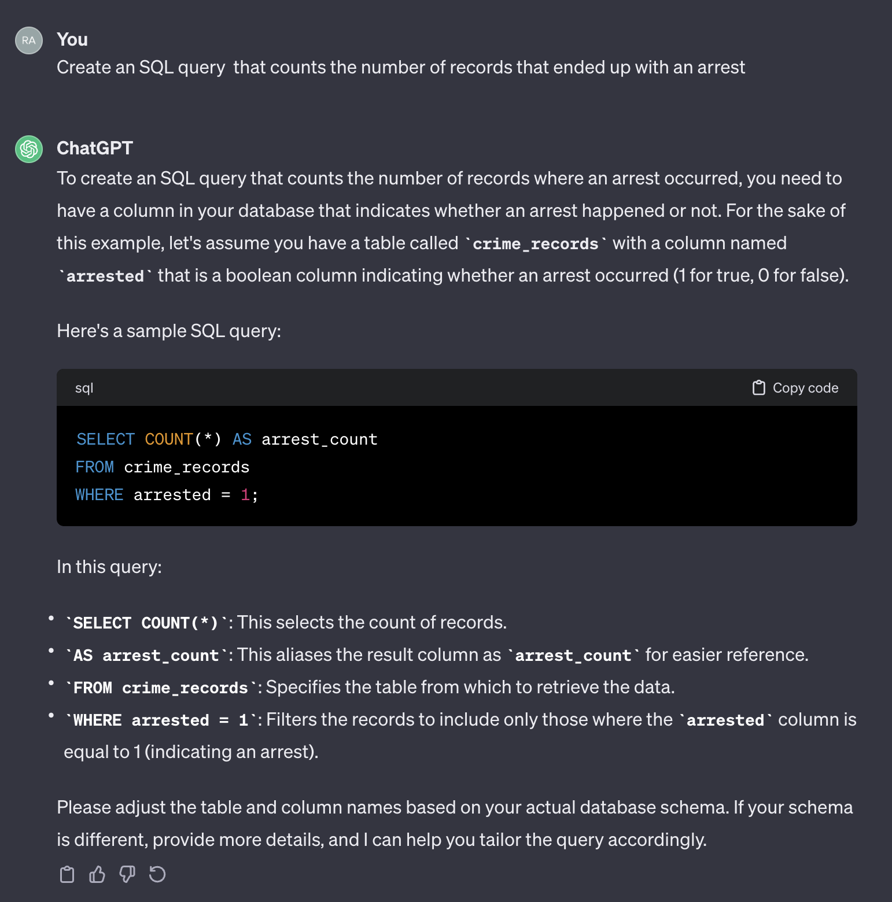
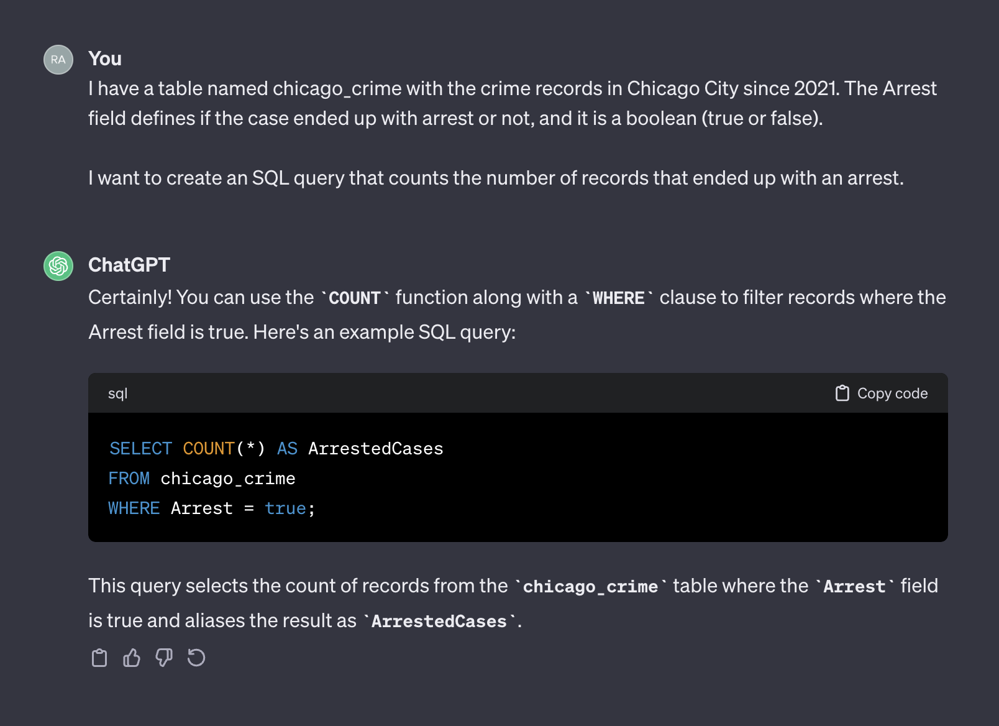

# lang2sql

This repo provides a step-by-step guide and a template for setting up a natural language to SQL code generator with the OpneAI API.

## Table of Contents:
- [Motivation](https://github.com/RamiKrispin/lang2sql#motivation)
- [Scope and General Architecture](https://github.com/RamiKrispin/lang2sql#scope-and-general-architecture)
- [Prerequisites](https://github.com/RamiKrispin/lang2sql#prerequisites)
- [Data](https://github.com/RamiKrispin/lang2sql#data)
- [Setting up a SQL generator](https://github.com/RamiKrispin/lang2sql#setting-up-a-sql-generator)
- [Summary](https://github.com/RamiKrispin/lang2sql#summary)
- [Resources](https://github.com/RamiKrispin/lang2sql#resources)
- [License](https://github.com/RamiKrispin/lang2sql#license)


## Motivation

The rapid development of natural language models, especially Large Language Models (LLMs), has presented numerous possibilities for various fields. One of the most common applications is using LLMs for coding. For instance, OpenAI's chatGPT and Meta's Code LLAMA are LLMs that offer state-of-the-art natural language to code generators. One potential use case is a natural language to SQL code generator, which could assist non-technical professionals with simple data requests and hopefully enable the data teams to focus on more data-intensive tasks. This tutorial focuses on setting up a language for SQL code generator using the OpenAI API.

### What can you do with language to SQL code generator application?

One possible application is a chatbot that can respond to user queries with relevant data (Figure 1). The chatbot can be integrated with a Slack channel using a Python application that performs the following steps: 
- Receives the user's question 
- Converts the question into a prompt
- Sends a GET request to the OpenAI API with the prompt 
- Parses the returned JSON into a SQL query 
- Sends the query to the database 
- Returns the user a CSV file containing the relevant data

<figure>
</a>
<figcaption> Figure 1 - Language to SQL code generator use case</figcaption>
</figure>

<br>
<br />

In this tutorial, we will build a step-by-step Python application that converts user questions into SQL queries.

## Scope and General Architecture

This tutorial provides a step-by-step guide on how to set up a Python application that converts general questions into SQL queries using the OpenAI API. That includes the following functionality:
- Generalized - the application is not limited to a specific table and can be used on any table
- For simplicity, the application is limited to a single table (e.g., no joins)
- Dockerized - develop the application inside a dockerized environment for a simple deployment

Figure 2 below describes the general architecture of a simple language to SQL code generator. 

<figure>
</a>
<figcaption> Figure 2 - Language to SQL code generator general architecture</figcaption>
</figure>

<br>
<br />

The scope and focus of this tutorial is on the green box - building the following functionality:
- **Question to Prompt** - transform the question into a prompt format:    
    - Pull the table information to create the prompt context
    - Add the question to the prompt

- **API Handler** - a function that works with the OpenAI API:
    - Send a GET request with the prompt
    - Parse the answer into an SQL query
- **DB Handler** - a function that sends the SQL query to the database and returns the required data

## Prerequisites

The main prerequisite for this tutorial is basic knowledge of Python. That includes the following functionality:
- Setting Python functions and objects
- Working with tabular data (i.e., pandas, CSV, etc.) and non-structure data format(i.e., JSON, etc.)
- Working with Python libraries 

In addition, basic knowledge of SQL and access to the OpenAI API are required.

### Nice to Have

While not necessary, having a basic knowledge of Docker is helpful, as the tutorial was created in a Dockerized environment using VScode's Dev Containers extension. If you don't have experience with Docker or the extension, you can still run the tutorial by creating a virtual environment and installing the required libraries (as described below). Knowledge of Prompt engineering and the OpenAI API is also beneficial.

I created a detailed tutorial about setting a Python dockerized environment with VScode and the Dev Containers extension:

https://github.com/RamiKrispin/vscode-python

### Python Libraries

To set up a natural language to SQL code generation, we will use the following Python libraries:
- `pandas` - to process data throughout the process
- `duckdb` - to simulate the work with the database
- `openai` - to work with the OpenAI API
- `time` and `os` - to load CSV files and format fields 

This repository contains the necessary settings to launch a Dockerized environment with the tutorial requirements in VScode and the Dev Containers extension. More details are available in the next section.

Alternatively, you can set up a virtual environment and install the tutorial requirements by following the instructions below using the instructions in the [Using Virtual Environment]() section.

### Using Docker with VScode

This tutorial was built inside a dockerized environment with VScode and the [Dev Containers](https://marketplace.visualstudio.com/items?itemName=ms-vscode-remote.remote-containers) extension. To run it with VScode, you will need to install the Dev Containers extension and have Docker Desktop (or equivalent) open. The settings of the environment are available under the `.devcontainer` folder:

```shell
.── .devcontainer
    ├── Dockerfile
    ├── Dockerfile.dev
    ├── devcontainer.json
    ├── install_dependencies_core.sh
    ├── install_dependencies_other.sh
    ├── install_quarto.sh
    ├── requirements_core.txt
    ├── requirements_openai.txt
    └── requirements_transformers.txt

```
The `devcontainer.json` has the build instructions and the VScode settings for this dockerized environment:

```json
{
    "name": "lang2sql",
    "build": {
        "dockerfile": "Dockerfile",
        "args": {
            "ENV_NAME": "lang2sql",
            "PYTHON_VER": "3.10",
            "METHOD": "openai",
            "QUARTO_VER": "1.3.450"
        },
        "context": "."
    },
    "customizations": {
        "settings": {
            "python.defaultInterpreterPath": "/opt/conda/envs/lang2sql/bin/python",
            "python.selectInterpreter": "/opt/conda/envs/lang2sql/bin/python"
        },
        "vscode": {
            "extensions": [
                "quarto.quarto",
                "ms-azuretools.vscode-docker",
                "ms-python.python",
                "ms-vscode-remote.remote-containers",
                "yzhang.markdown-all-in-one",
                "redhat.vscode-yaml",
                "ms-toolsai.jupyter"
            ]
        }
    },
    "remoteEnv": {
        "OPENAI_KEY": "${localEnv:OPENAI_KEY}"
    }
}

```

Where the `build` argument defines the `docker build` method and sets the arguments for the build. In this case, we set the Python version to `3.10`, and the conda virtual environment to `ang2sql`. The `METHOD` argument defines the type of environment - either `openai` to install the requirements libraries for this tutorial using the OpenAI API or `transformers` to set the environment for HuggingFaces API (which is out of scope for this tutorial).


The `remoteEnv` argument enables setting environment variables. We will use it to set the OpenAI API key. In this case, I set the variable locally as `OPENAI_KEY`, and I am loading it using the `localEnv` argument.

If you want to learn more about setting up a Python development environment with VScode and Docker, check this [tutorial](https://github.com/RamiKrispin/vscode-python).


### Using Virtual Environment

If you are not using the tutorial dockerized environment, you can create a local virtual environment from the command line using the script below:

```shell
ENV_NAME=openai_api
PYTHON_VER=3.10
conda create -y --name $ENV_NAME python=$PYTHON_VER 

conda activate $ENV_NAME

pip3 install -r ./.devcontainer/requirements_core.txt
pip3 install -r ./.devcontainer/requirements_openai.txt

```

**Note:** I used `conda` and it should work as well with any other virutal environment method.

We use the `ENV_NAME` and `PYTHON_VER` variables to set the virtual environment and the Python version, respectively.

To confirm that your environment is properly set, use the `conda list` to confirm that the required Python libraries are installed. You should expect the below output:

```shell
(openai_api) root@0ca5b8000cd5:/workspaces/lang2sql# conda list
# packages in environment at /opt/conda/envs/openai_api:
#
# Name                    Version                   Build  Channel
_libgcc_mutex             0.1                        main  
_openmp_mutex             5.1                      51_gnu  
aiohttp                   3.9.0                    pypi_0    pypi
aiosignal                 1.3.1                    pypi_0    pypi
asttokens                 2.4.1                    pypi_0    pypi
async-timeout             4.0.3                    pypi_0    pypi
attrs                     23.1.0                   pypi_0    pypi
bzip2                     1.0.8                hfd63f10_2  
ca-certificates           2023.08.22           hd43f75c_0  
certifi                   2023.11.17               pypi_0    pypi
charset-normalizer        3.3.2                    pypi_0    pypi
comm                      0.2.0                    pypi_0    pypi
contourpy                 1.2.0                    pypi_0    pypi
cycler                    0.12.1                   pypi_0    pypi
debugpy                   1.8.0                    pypi_0    pypi
decorator                 5.1.1                    pypi_0    pypi
duckdb                    0.9.2                    pypi_0    pypi
exceptiongroup            1.2.0                    pypi_0    pypi
executing                 2.0.1                    pypi_0    pypi
fonttools                 4.45.1                   pypi_0    pypi
frozenlist                1.4.0                    pypi_0    pypi
gensim                    4.3.2                    pypi_0    pypi
idna                      3.5                      pypi_0    pypi
ipykernel                 6.26.0                   pypi_0    pypi
ipython                   8.18.0                   pypi_0    pypi
jedi                      0.19.1                   pypi_0    pypi
joblib                    1.3.2                    pypi_0    pypi
jupyter-client            8.6.0                    pypi_0    pypi
jupyter-core              5.5.0                    pypi_0    pypi
kiwisolver                1.4.5                    pypi_0    pypi
ld_impl_linux-aarch64     2.38                 h8131f2d_1  
libffi                    3.4.4                h419075a_0  
libgcc-ng                 11.2.0               h1234567_1  
libgomp                   11.2.0               h1234567_1  
libstdcxx-ng              11.2.0               h1234567_1  
libuuid                   1.41.5               h998d150_0  
matplotlib                3.8.2                    pypi_0    pypi
matplotlib-inline         0.1.6                    pypi_0    pypi
multidict                 6.0.4                    pypi_0    pypi
ncurses                   6.4                  h419075a_0  
nest-asyncio              1.5.8                    pypi_0    pypi
numpy                     1.26.2                   pypi_0    pypi
openai                    0.28.1                   pypi_0    pypi
openssl                   3.0.12               h2f4d8fa_0  
packaging                 23.2                     pypi_0    pypi
pandas                    2.0.0                    pypi_0    pypi
parso                     0.8.3                    pypi_0    pypi
pexpect                   4.8.0                    pypi_0    pypi
pillow                    10.1.0                   pypi_0    pypi
pip                       23.3.1          py310hd43f75c_0  
platformdirs              4.0.0                    pypi_0    pypi
prompt-toolkit            3.0.41                   pypi_0    pypi
psutil                    5.9.6                    pypi_0    pypi
ptyprocess                0.7.0                    pypi_0    pypi
pure-eval                 0.2.2                    pypi_0    pypi
pygments                  2.17.2                   pypi_0    pypi
pyparsing                 3.1.1                    pypi_0    pypi
python                    3.10.13              h4bb2201_0  
python-dateutil           2.8.2                    pypi_0    pypi
pytz                      2023.3.post1             pypi_0    pypi
pyzmq                     25.1.1                   pypi_0    pypi
readline                  8.2                  h998d150_0  
requests                  2.31.0                   pypi_0    pypi
scikit-learn              1.3.2                    pypi_0    pypi
scipy                     1.11.4                   pypi_0    pypi
setuptools                68.0.0          py310hd43f75c_0  
six                       1.16.0                   pypi_0    pypi
smart-open                6.4.0                    pypi_0    pypi
sqlite                    3.41.2               h998d150_0  
stack-data                0.6.3                    pypi_0    pypi
threadpoolctl             3.2.0                    pypi_0    pypi
tk                        8.6.12               h241ca14_0  
tornado                   6.3.3                    pypi_0    pypi
tqdm                      4.66.1                   pypi_0    pypi
traitlets                 5.13.0                   pypi_0    pypi
tzdata                    2023.3                   pypi_0    pypi
urllib3                   2.1.0                    pypi_0    pypi
wcwidth                   0.2.12                   pypi_0    pypi
wheel                     0.41.2          py310hd43f75c_0  
xz                        5.4.2                h998d150_0  
yarl                      1.9.3                    pypi_0    pypi
zlib                      1.2.13               h998d150_0  

```

### Setting Access to the OpenAI API

We will use the OpenAI API to access chatGPT using the text-davinci-003 engine. This required an active OpenAI account and API key. It is straightforward to set an account and API key following the instructions in the below link:

https://openai.com/product

Once you set the access to the API and a key, I recommend adding the key as an environment variable to your `.zshrc` file (or any other format you are using to store environment variables on your shell system). I stored my API key under the `OPENAI_KEY` environment variable.  For convincing reasons, I recommend you use the same naming convention.

To set the variable on the `.zshrc` file (or equivalent), add the below line to the file:

```shell
export OPENAI_KEY="YOUR_API_KEY"
```

If using VScode or running from the terminal, you must restart your session after adding the variable to the `.zshrc` file.


## Data

In order to simulate database functionality, we will be utilizing the [Chicago Crime](https://data.cityofchicago.org/Public-Safety/Crimes-2001-to-Present/ijzp-q8t2) dataset. This dataset provides in-depth information regarding the crimes recorded in the city of Chicago since 2001. With close to 8 million records and 22 columns, the dataset includes information such as the crime classification, location, time, result, etc. The data is available to download from the Chicago Data Portal. Since we store the data locally as Pandas data frame and use DuckDB to simulate SQL query, we will download a subset of the data using the last three years.


<figure>
</a>
<figcaption> Figure 3 - The Chicago Crime dataset</figcaption>
</figure>

<br>
<br />


You can pull the data from the API or download a CSV file. To avoid calling the API each time I run the script, I download the files and store them under the data folder. Below are the links to the datasets by year:
- [2021](https://data.cityofchicago.org/Public-Safety/Crimes-2021/dwme-t96c)
- [2022](https://data.cityofchicago.org/Public-Safety/Crimes-2022/9hwr-2zxp)
- [2023](https://data.cityofchicago.org/Public-Safety/Crimes-2023/xguy-4ndq)

To download the data, use the `Export` button on the top right side, select the `CSV` option, and click the `Download` button, as seen in Figure 4.


<figure>
</a>
<figcaption> Figure 4 - Download a full year of data as the CSV file using the Export option</figcaption>
</figure>

<br>
<br />

I used the following naming convention - chicago_crime_YEAR.csv and saved the files in the `data` folder. Each file size is close to 50 Mb. Therefore, I added them to the git ignore file under the `data` folder, and they are not available on this repo. After downloading the files and setting their names, you should have the following files in the folder:
```shell
|── data
    ├── chicago_crime_2021.csv
    ├── chicago_crime_2022.csv
    └── chicago_crime_2023.csv

```

**Note:** As of the time of creating this tutorial, the data for 2023 is still getting updated. Therefore, you may receive slightly different results when running some of the queries in the following section.

<br>
<br />

## Setting up a SQL Generator

Let's move on to the exciting part, which is setting up a SQL code generator. In this section, we'll create a Python function that takes in a user's question, the associated SQL table, and the OpenAI API key and outputs the SQL query that answers the user's question.

Let's start by loading the Chicago Crime dataset and the required Python libraries.

### Load Dependencies and Data

First thing first - let's load the required Python libraries:
```python
import pandas as pd
import duckdb
import openai
import time 
import os
```

We will utilize the **os** and **time** libraries to load CSV files and reformat certain fields. The data will be processed using the **pandas** library, and we will simulate SQL commands with the **DuckDB** library. Lastly, we will establish a connection to the OpenAI API using the **openai** library.


Next, we will load the `CSV` files from the data folder. The code below reads all the `CSV` files available in the data folder: 

```python
path = "./data"

files = [x for x in os.listdir(path = path) if ".csv" in x]
```
If you downloaded the corresponding files for the years 2021 to 2023 and used the same naming convention, you should expect the following output:

``` python
print(files)

['chicago_crime_2022.csv', 'chicago_crime_2023.csv', 'chicago_crime_2021.csv']
```

Next, we will read and load all the files and append them into a pandas data frame:

```python 
chicago_crime = pd.concat((pd.read_csv(path +"/" + f) for f in files), ignore_index=True)

chicago_crime.head

```

If you loaded the files correctly, you should expect the following output:

```python 
<bound method NDFrame.head of               ID Case Number                    Date                   Block   
0       12589893    JF109865  01/11/2022 03:00:00 PM    087XX S KINGSTON AVE  \
1       12592454    JF113025  01/14/2022 03:55:00 PM       067XX S MORGAN ST   
2       12601676    JF124024  01/13/2022 04:00:00 PM    031XX W AUGUSTA BLVD   
3       12785595    JF346553  08/05/2022 09:00:00 PM  072XX S UNIVERSITY AVE   
4       12808281    JF373517  08/14/2022 02:00:00 PM     055XX W ARDMORE AVE   
...          ...         ...                     ...                     ...   
648826     26461    JE455267  11/24/2021 12:51:00 AM     107XX S LANGLEY AVE   
648827     26041    JE281927  06/28/2021 01:12:00 AM       117XX S LAFLIN ST   
648828     26238    JE353715  08/29/2021 03:07:00 AM    010XX N LAWNDALE AVE   
648829     26479    JE465230  12/03/2021 08:37:00 PM         000XX W 78TH PL   
648830  11138622    JA495186  05/21/2021 12:01:00 AM      019XX N PULASKI RD   

        IUCR                Primary Type   
0       1565                 SEX OFFENSE  \
1       2826               OTHER OFFENSE   
2       1752  OFFENSE INVOLVING CHILDREN   
3       1544                 SEX OFFENSE   
4       1562                 SEX OFFENSE   
...      ...                         ...   
648826  0110                    HOMICIDE   
648827  0110                    HOMICIDE   
648828  0110                    HOMICIDE   
648829  0110                    HOMICIDE   
648830  1752  OFFENSE INVOLVING CHILDREN   
...
648828  41.899709 -87.718893  (41.899709327, -87.718893208)  
648829  41.751832 -87.626374  (41.751831742, -87.626373808)  
648830  41.915798 -87.726524  (41.915798196, -87.726524412) 

```

**Note:** When creating this tutorial, partial data for 2023 was available. Appending the three files would result in more rows than shown (648830 rows).


### Prompt Enineering 101

Before we get into the Python code, let's pause and review how prompt engineering works and how we can help ChatGPT (and generally any LLM) generate the best results. We will use in this section the [ChatGPT web interface](https://chat.openai.com/).

One major factor in statistical and machine learning models is that the output quality depends on the input quality. As the famous phrase says - *junk-in, junk-out*. Similarly, the quality of the LLM output depends on the quality of the prompt. 

For example, let's assume we want to count the number of cases that ended up with an arrest.

If we use the following prompt:
```
Create an SQL query that counts the number of records that ended up with an arrest.
```
Here is the output from ChatGPT:

<figure>
</a>
<figcaption> Figure 5 - Basic prompt without context</figcaption>
</figure>

<br>
<br />

It's worth noting that ChatGPT provides a generic response. Although it's generally correct, it may not be practical to use in an automated process. Firstly, the field names in the response don't match the ones in the actual table we need to query. Secondly, the field that represents the arrest outcome is a boolean (`true` or `false`) instead of an integer (`0` or `1`).

ChatGPT, in that sense, acts like a human. It's unlikely that you will receive a more accurate answer from a human by posting the same question on a coding form like Stack Overflow or any other similar platform. Given that we did not provide any context or additional information about the table characteristics, expecting ChatGPT to guess the field names and their values would be unreasonable. The context is a crucial factor in any prompt. To illustrate this point, let's see how ChatGPT handles the following prompt:

```
I have a table named chicago_crime with the crime records in Chicago City since 2021. The Arrest field defines if the case ended up with arrest or not, and it is a boolean (true or false).  

I want to create an SQL query that counts the number of records that ended up with an arrest.
```

Here is the output from ChatGPT:

<figure>
</a>
<figcaption> Figure 5 - Basic prompt without context</figcaption>
</figure>

<br>
<br />

This time, after adding context, ChatGPT returned a correct query that we can use as is. Generally, when working with a text generator, the prompt should include two components - context and request. In the above prompt, the first paragraph represents the prompt's context:

```
I have a table named chicago_crime with the crime records in Chicago City since 2021. The Arrest field defines if the case ended up with arrest or not, and it is a boolean (true or false). 
```
Where the second paragraph, represents the request:
```
I want to create an SQL query that counts the number of records that ended up with an arrest.
```

The OpenAI API refers to the context as a `system` and request as a `user`.

The OpenAI API documentation provides a [recommendation](https://platform.openai.com/examples/default-sql-translate) for how to set the `system` and `user` components in a prompt when requesting to generate an SQL code:


`System`
```
Given the following SQL tables, your job is to write queries given a user’s request.

CREATE TABLE Orders (
  OrderID int,
  CustomerID int,
  OrderDate datetime,
  OrderTime varchar(8),
  PRIMARY KEY (OrderID)
);

CREATE TABLE OrderDetails (
  OrderDetailID int,
  OrderID int,
  ProductID int,
  Quantity int,
  PRIMARY KEY (OrderDetailID)
);

CREATE TABLE Products (
  ProductID int,
  ProductName varchar(50),
  Category varchar(50),
  UnitPrice decimal(10, 2),
  Stock int,
  PRIMARY KEY (ProductID)
);

CREATE TABLE Customers (
  CustomerID int,
  FirstName varchar(50),
  LastName varchar(50),
  Email varchar(100),
  Phone varchar(20),
  PRIMARY KEY (CustomerID)
);
```

`User`
```
Write a SQL query which computes the average total order value for all orders on 2023-04-01.
```

In the next section, we will use the above OpenAI example and generalize it into a general-purpose template.

### Setting Prompt Template

In the previous section, we discussed the importance of prompt engineering and how providing a good context can improve the LLM response accuracy. In addition, we saw the OpenAI recommended prompt structure for SQL code generation. In this section, we will focus on generalizing the process of creating prompts for SQL generation based on those principles. The goal is to build a Python function that receives a table name and a user question and creates the prompt accordingly. For example, for the table `chicago_crime` table we loaded before and the question we asked in the previous section, the function should create the below prompt: 

```
Given the following SQL table, your job is to write queries given a user’s request. 


CREATE TABLE chicago_crime (ID BIGINT, Case Number VARCHAR, Date VARCHAR, Block VARCHAR, IUCR VARCHAR, Primary Type VARCHAR, Description VARCHAR, Location Description VARCHAR, Arrest BOOLEAN, Domestic BOOLEAN, Beat BIGINT, District BIGINT, Ward DOUBLE, Community Area BIGINT, FBI Code VARCHAR, X Coordinate DOUBLE, Y Coordinate DOUBLE, Year BIGINT, Updated On VARCHAR, Latitude DOUBLE, Longitude DOUBLE, Location VARCHAR) 


Write a SQL query that returns - How many cases ended up with arrest?
```

Let's start with the prompt structure. We will adopt the OpenAI format and use the following template:

```python
system_template = """

    Given the following SQL table, your job is to write queries given a user’s request. \n

    CREATE TABLE {} ({}) \n
    """

user_template = "Write a SQL query that returns - {}"
```

Where the `system_template` received two elements:
- The table name
- The table fields and their attributes

For this tutorial, we will use the DuckDB library to handle the pandas data frame as it was an SQL table and extract the table's field names and attributes using the `duckdb.sql` function. For example, let's use the `DESCRIBE` SQL command to extract the `chicago_crime` table fields information:

```python
duckdb.sql("DESCRIBE SELECT * FROM chicago_crime;")
```

Which should return the below table:

```python
┌──────────────────────┬─────────────┬─────────┬─────────┬─────────┬─────────┐
│     column_name      │ column_type │  null   │   key   │ default │  extra  │
│       varchar        │   varchar   │ varchar │ varchar │ varchar │ varchar │
├──────────────────────┼─────────────┼─────────┼─────────┼─────────┼─────────┤
│ ID                   │ BIGINT      │ YES     │ NULL    │ NULL    │ NULL    │
│ Case Number          │ VARCHAR     │ YES     │ NULL    │ NULL    │ NULL    │
│ Date                 │ VARCHAR     │ YES     │ NULL    │ NULL    │ NULL    │
│ Block                │ VARCHAR     │ YES     │ NULL    │ NULL    │ NULL    │
│ IUCR                 │ VARCHAR     │ YES     │ NULL    │ NULL    │ NULL    │
│ Primary Type         │ VARCHAR     │ YES     │ NULL    │ NULL    │ NULL    │
│ Description          │ VARCHAR     │ YES     │ NULL    │ NULL    │ NULL    │
│ Location Description │ VARCHAR     │ YES     │ NULL    │ NULL    │ NULL    │
│ Arrest               │ BOOLEAN     │ YES     │ NULL    │ NULL    │ NULL    │
│ Domestic             │ BOOLEAN     │ YES     │ NULL    │ NULL    │ NULL    │
│ Beat                 │ BIGINT      │ YES     │ NULL    │ NULL    │ NULL    │
│ District             │ BIGINT      │ YES     │ NULL    │ NULL    │ NULL    │
│ Ward                 │ DOUBLE      │ YES     │ NULL    │ NULL    │ NULL    │
│ Community Area       │ BIGINT      │ YES     │ NULL    │ NULL    │ NULL    │
│ FBI Code             │ VARCHAR     │ YES     │ NULL    │ NULL    │ NULL    │
│ X Coordinate         │ DOUBLE      │ YES     │ NULL    │ NULL    │ NULL    │
│ Y Coordinate         │ DOUBLE      │ YES     │ NULL    │ NULL    │ NULL    │
│ Year                 │ BIGINT      │ YES     │ NULL    │ NULL    │ NULL    │
│ Updated On           │ VARCHAR     │ YES     │ NULL    │ NULL    │ NULL    │
│ Latitude             │ DOUBLE      │ YES     │ NULL    │ NULL    │ NULL    │
│ Longitude            │ DOUBLE      │ YES     │ NULL    │ NULL    │ NULL    │
│ Location             │ VARCHAR     │ YES     │ NULL    │ NULL    │ NULL    │
├──────────────────────┴─────────────┴─────────┴─────────┴─────────┴─────────┤
│ 22 rows                                                          6 columns │
└────────────────────────────────────────────────────────────────────────────┘

```
**Note:** The information we need - the column name and its attribute are available on the first two columns. Therefore, we will need to parse those columns and combine them together to the following format:
```
Column_Name Column_Attribute
```
For example, the `Case Number` column should transfer into the following format:

```
Case Number VARCHAR
```

The `create_message` function below orchestrates the process of taking the table name and the question and generating the prompt using the above logic:

```python
def create_message(table_name, query):

    class message:
        def __init__(message, system, user, column_names, column_attr):
            message.system = system
            message.user = user
            message.column_names = column_names
            message.column_attr = column_attr

    
    system_template = """

    Given the following SQL table, your job is to write queries given a user’s request. \n

    CREATE TABLE {} ({}) \n
    """

    user_template = "Write a SQL query that returns - {}"
    
    tbl_describe = duckdb.sql("DESCRIBE SELECT * FROM " + table_name +  ";")
    col_attr = tbl_describe.df()[["column_name", "column_type"]]
    col_attr["column_joint"] = col_attr["column_name"] + " " +  col_attr["column_type"]
    col_names = str(list(col_attr["column_joint"].values)).replace('[', '').replace(']', '').replace('\'', '')

    system = system_template.format(table_name, col_names)
    user = user_template.format(query)

    m = message(system = system, user = user, column_names = col_attr["column_name"], column_attr = col_attr["column_type"])
    return m

```

The function creates the prompt template and returns the prompt `system` and `user` components and the columns names and attributes. For example, let's run the number of arrest question: 

```python
query = "How many cases ended up with arrest?"
msg = create_message(table_name = "chicago_crime", query = query)
```

This will reutns:
```python
print(msg.system)

Given the following SQL table, your job is to write queries given a user’s request. 


CREATE TABLE chicago_crime (ID BIGINT, Case Number VARCHAR, Date VARCHAR, Block VARCHAR, IUCR VARCHAR, Primary Type VARCHAR, Description VARCHAR, Location Description VARCHAR, Arrest BOOLEAN, Domestic BOOLEAN, Beat BIGINT, District BIGINT, Ward DOUBLE, Community Area BIGINT, FBI Code VARCHAR, X Coordinate DOUBLE, Y Coordinate DOUBLE, Year BIGINT, Updated On VARCHAR, Latitude DOUBLE, Longitude DOUBLE, Location VARCHAR) 

print(msg.user)

Write a SQL query that returns - How many cases ended up with arrest?

print(msg.column_names)

0                       ID
1              Case Number
2                     Date
3                    Block
4                     IUCR
5             Primary Type
6              Description
7     Location Description
8                   Arrest
9                 Domestic
10                    Beat
11                District
12                    Ward
13          Community Area
14                FBI Code
15            X Coordinate
16            Y Coordinate
17                    Year
18              Updated On
19                Latitude
20               Longitude
21                Location
Name: column_name, dtype: object

print(msg.column_attr)

0      BIGINT
1     VARCHAR
2     VARCHAR
3     VARCHAR
4     VARCHAR
5     VARCHAR
6     VARCHAR
7     VARCHAR
8     BOOLEAN
9     BOOLEAN
10     BIGINT
11     BIGINT
12     DOUBLE
13     BIGINT
14    VARCHAR
15     DOUBLE
16     DOUBLE
17     BIGINT
18    VARCHAR
19     DOUBLE
20     DOUBLE
21    VARCHAR
Name: column_type, dtype: object
```

The output of the `create_message` function was designed to fit the OpenAI API `ChatCompletion.create `function arguments, which we will review in the next section.


### Working with the OpenAI API

This section focuses on the [openai](https://github.com/openai/openai-python) Python library functionality. The openai library enables seamless access to the OpenAI REST API. We will use the library to connect to the API and send GET requests with our prompt. 

Let's start by connecting to the API by feeding our API to the `openai.api_key` function:

```python
openai.api_key = os.getenv('OPENAI_KEY')
```

**Note:** We used the `getenv` function from the `os` library to load the OPENAI_KEY environment variable. Alternatively, you can feed directly your API key:

```python
openai.api_key = "YOUR_OPENAI_API_KEY"
```

The OpenAI API provides access to a variety of LLMs with different functionalities. You can use the openai.Model.list function to get a list of the available models:

```python
openai.Model.list()
```

To transform it into a nice format, you can wrap it in a `pandas` data frame:

``` python
openai_api_models = pd.DataFrame(openai.Model.list()["data"])

openai_api_models.head
```

And should expect the following output:
```
<bound method NDFrame.head of                                id object     created         owned_by
0     text-search-babbage-doc-001  model  1651172509       openai-dev
1                           gpt-4  model  1687882411           openai
2              curie-search-query  model  1651172509       openai-dev
3                text-davinci-003  model  1669599635  openai-internal
4   text-search-babbage-query-001  model  1651172509       openai-dev
..                            ...    ...         ...              ...
65    gpt-3.5-turbo-instruct-0914  model  1694122472           system
66                       dall-e-2  model  1698798177           system
67                     tts-1-1106  model  1699053241           system
68                  tts-1-hd-1106  model  1699053533           system
69              gpt-3.5-turbo-16k  model  1683758102  openai-internal

[70 rows x 4 columns]>
```

For our use case, text generation, we will use the `gpt-3.5-turbo` model, which is an improvement of the GPT3 model. The `gpt-3.5-turbo` model represents a series of models that keep getting updated, and by default, if the model version is not specified, the API will point out to the most recent stable release. When creating this tutorial, the default 3.5 model was `gpt-3.5-turbo-0613`, using 4,096 tokens, and trained with data up to September 2021.


To send a `GET` request with our prompt, we will use the `ChatCompletion.create` function. The function has many arguments, and we will use the following ones:
- `model` - The model ID to use, a full list available [here](https://platform.openai.com/docs/models)
- `messages` - A list of messages comprising the conversation so far (e.g. the prompt)
- `temperature` - Manage the randomness or determinism of the process output by setting the sampling temperature level. The temperature level accepts values between 0 and 2. When the argument value is higher, the output becomes more random. Conversely, when the argument value is closer to 0, the output becomes more deterministic (reproducible)
- `max_tokens` - The maximum number of tokens to generate in the completion


The full list of the function arguments available on the [API documentaiton](https://platform.openai.com/docs/api-reference/chat/create).


In the below example, we will use the same prompt as the one used on the ChatGPT web interface (i.e., Figure 5), this time using the API. We will generate the prompt with the `create_message` function:

```python
query = "How many cases ended up with arrest?"
prompt = create_message(table_name = "chicago_crime", query = query)
```

Let's transform the above prompt into the structure of the `ChatCompletion.create` function `messages` argument:

``` python
  message = [
    {
      "role": "system",
      "content": prompt.system
    },
    {
      "role": "user",
      "content": prompt.user
    }
    ]
```


Next, we will send the prompt (i.e., the `message` object) to the API using the `ChatCompletion.create` function:


```python
 response = openai.ChatCompletion.create(
        model = "gpt-3.5-turbo",
        messages = message,
        temperature = 0,
        max_tokens = 256)
```

We will set the `temperature` argument to 0 to ensure high reproducibility and limit the number of tokens in the text completion to 256. The function returns a `JSON` object with the text completion, metadata, and other information:

```python
print(response)

<OpenAIObject chat.completion id=chatcmpl-8PzomlbLrTOTx1uOZm4WQnGr4JwU7 at 0xffff4b0dcb80> JSON: {
  "id": "chatcmpl-8PzomlbLrTOTx1uOZm4WQnGr4JwU7",
  "object": "chat.completion",
  "created": 1701206520,
  "model": "gpt-3.5-turbo-0613",
  "choices": [
    {
      "index": 0,
      "message": {
        "role": "assistant",
        "content": "SELECT COUNT(*) FROM chicago_crime WHERE Arrest = true;"
      },
      "finish_reason": "stop"
    }
  ],
  "usage": {
    "prompt_tokens": 137,
    "completion_tokens": 12,
    "total_tokens": 149
  }
}

```
Using the response indies, we can extract the SQL query:

```python
sql = response["choices"][0]["message"]["content"]

print(sql)
```

```sql
'SELECT COUNT(*) FROM chicago_crime WHERE Arrest = true;'
```

Using the `duckdb.sql` function to run the SQL code:

``` python
duckdb.sql(sql).show()

┌──────────────┐
│ count_star() │
│    int64     │
├──────────────┤
│        77635 │
└──────────────┘
```


In the next section, we will generalize and functionalize all the steps.

### Stitching it All Together

In the previous sections, we introduced the prompt format, set the `create_message` function, and reviewed the functionality of the `ChatCompletion.create` function. In this section we stitch it all together. 

One thing to note about the returned SQL code from the `ChatCompletion.create` function is that the variable does not return with quotes. That might be an issue when the variable name in the query combines two or more words. For example, using a variable such as `Case Number` or `Primary Type` from the `chicago_crime` inside a query without using quotes will result in an error.

We will use the below helper function to add quotes to the variables in the query if the returned query does not have one:

```python
def add_quotes(query, col_names):
    for i in col_names:
        if i in query:
            l = query.find(i)
            if query[l-1] != "'" and query[l-1] != '"': 
                query = str(query).replace(i, '"' + i + '"') 

    return(query)
```

The function inputs are the query and the corresponding table's column names. It loops over the column names and adds quotes if it finds a match within the query. For example, we can run it with the SQL query we parsed from the `ChatCompletion.create` function output:

```python
add_quotes(query = sql, col_names = prompt.column_names)

'SELECT COUNT(*) FROM chicago_crime WHERE "Arrest" = true;'
```
You can notice that it added quotes to the `Arrest` variable.

We can now introduce the `lang2sql` function that leverages the three functions we introduced so far - `create_message`, `ChatCompletion.create`, and `add_quotes` to translate a user question to a SQL code:

```python
def lang2sql(api_key, table_name, query, model = "gpt-3.5-turbo", temperature = 0, max_tokens = 256, frequency_penalty = 0,presence_penalty= 0):
    class response:
        def __init__(output, message, response, sql):
            output.message = message
            output.response = response
            output.sql = sql

    openai.api_key = api_key

    m = create_message(table_name = table_name, query = query)

    message = [
    {
      "role": "system",
      "content": m.system
    },
    {
      "role": "user",
      "content": m.user
    }
    ]
    
    openai_response = openai.ChatCompletion.create(
        model = model,
        messages = message,
        temperature = temperature,
        max_tokens = max_tokens,
        frequency_penalty = frequency_penalty,
        presence_penalty = presence_penalty)
    
    sql_query = add_quotes(query = openai_response["choices"][0]["message"]["content"], col_names = m.column_names)

    output = response(message = m, response = openai_response, sql = sql_query)

    return output

```

The function receives, as inputs, the OpenAI API key, table name, and the core parameters of the `ChatCompletion.create` function and returns an object with the prompt, the API response, and the parsed query. For example, let's try to re-run the same query we used in the previous section with the `lang2sql` function:


``` python
query = "How many cases ended up with arrest?"
response = lang2sql(api_key = api_key, table_name = "chicago_crime", query = query)

```
We can extract the SQL query from the output object:

```python
print(response.sql)
```
```sql
SELECT COUNT(*) FROM chicago_crime WHERE "Arrest" = true;
```

We can test the output with respect to the results we received in the previous section:

``` python
duckdb.sql(response.sql).show()

┌──────────────┐
│ count_star() │
│    int64     │
├──────────────┤
│        77635 │
└──────────────┘
```

Let's now add additional complexity to the question and ask for cases that ended up with an arrest during 2022:

``` python
query = "How many cases ended up with arrest during 2022"
response = lang2sql(api_key = api_key, table_name = "chicago_crime", query = query)
```

As you can see, the model correctly identified the relevant field as `Year` and generated the correct query:

```python
print(response.sql)
```

The SQL code:

```sql
SELECT COUNT(*) FROM chicago_crime WHERE "Arrest" = TRUE AND "Year" = 2022;
```

Testing the query on table:

```python
duckdb.sql(response.sql).show()

┌──────────────┐
│ count_star() │
│    int64     │
├──────────────┤
│        27805 │
└──────────────┘
```

Here is an example of a simple question that required a grouping by a specific variable:

```python
query = "Summarize the cases by primary type"
response = lang2sql(api_key = api_key, table_name = "chicago_crime", query = query)

print(response.sql)
```
You can see from the response output that the SQL code in this case is correct:

```sql
SELECT "Primary Type", COUNT(*) as TotalCases
FROM chicago_crime
GROUP BY "Primary Type"
```

This is the output of the query:

```python 
duckdb.sql(response.sql).show()

┌───────────────────────────────────┬────────────┐
│           Primary Type            │ TotalCases │
│              varchar              │   int64    │
├───────────────────────────────────┼────────────┤
│ MOTOR VEHICLE THEFT               │      54934 │
│ ROBBERY                           │      25082 │
│ WEAPONS VIOLATION                 │      24672 │
│ INTERFERENCE WITH PUBLIC OFFICER  │       1161 │
│ OBSCENITY                         │        127 │
│ STALKING                          │       1206 │
│ BATTERY                           │     115760 │
│ OFFENSE INVOLVING CHILDREN        │       5177 │
│ CRIMINAL TRESPASS                 │      11255 │
│ PUBLIC PEACE VIOLATION            │       1980 │
│    ·                              │         ·  │
│    ·                              │         ·  │
│    ·                              │         ·  │
│ ASSAULT                           │      58685 │
│ CRIMINAL DAMAGE                   │      75611 │
│ DECEPTIVE PRACTICE                │      46377 │
│ NARCOTICS                         │      13931 │
│ BURGLARY                          │      19898 │
...
├───────────────────────────────────┴────────────┤
│ 31 rows (20 shown)                   2 columns │
└────────────────────────────────────────────────┘

```

Last but not least, the LLM can identify the context (e.g., which variable) even when we provide a partial variable name:
```python
query = "How many cases the type is robbery?"
response = lang2sql(api_key = api_key, table_name = "chicago_crime", query = query)

print(response.sql)
```
It returns the below SQL code:
```sql
SELECT COUNT(*) FROM chicago_crime WHERE "Primary Type" = 'ROBBERY';
```

This is the output of the query:

```python
duckdb.sql(response.sql).show()

┌──────────────┐
│ count_star() │
│    int64     │
├──────────────┤
│        25082 │
└──────────────┘
```


## Summary

In this tutorial, we have demonstrated how to build a SQL code generator with a few lines of Python code and utilize the OpenAI API. We have seen that the quality of the prompt is crucial for the success of the resulting SQL code. In addition to the context provided by the prompt, the field names should also provide information about the field's characteristics to help the LLM identify the relevance of the field to the user question. 


Although this tutorial was limited to working with a single table (e.g., no joins between tables), some LLMs, such as the ones available on OpenAI, can handle more complex cases, including working with multiple tables and identifying the correct join operations. Adjusting the lang2sql function to handle multiple tables could be a nice next step.

## Resources

- Chicago Crime data set - https://data.cityofchicago.org/Public-Safety/Crimes-2020/qzdf-xmn8
- OpenAI API documentation - https://platform.openai.com/docs/introduction
- OpenAI API registration - https://openai.com/product
- OpenAI API list of models - https://platform.openai.com/docs/models
- oepnai Python library - https://pypi.org/project/openai/
- Tutorial for setting a dockerized Python environment with VScode - https://github.com/RamiKrispin/vscode-python
## License

This tutorial is licensed under a [Creative Commons Attribution-NonCommercial-ShareAlike 4.0 International](https://creativecommons.org/licenses/by-nc-sa/4.0/) License.

