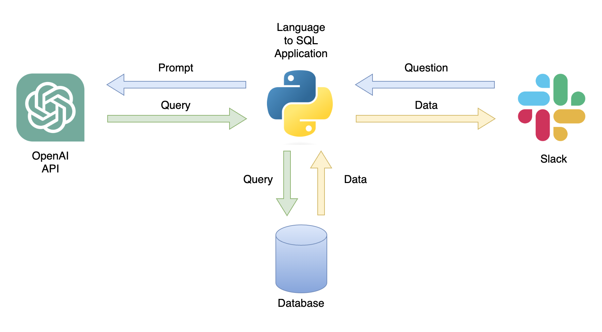

# lang2sql

🚧WIP 🏗️, pre spell checking🛠️

This repo provides a step-by-step guide and a template for setting up a natural language to SQL code generator with the OpneAI API.

## Table of Contents:
- [Motivation](https://github.com/RamiKrispin/lang2sql#motivation)
- [Scope](https://github.com/RamiKrispin/lang2sql#scope)
- [Prerequisites](https://github.com/RamiKrispin/lang2sql#prerequisites)
- [General Architecture](https://github.com/RamiKrispin/lang2sql#general-architecture)
- [Data](https://github.com/RamiKrispin/lang2sql#data)
- [Setting up SQL generator](https://github.com/RamiKrispin/lang2sql#setting-up-sql-generator)
- [Summary](https://github.com/RamiKrispin/lang2sql#summary)
- [Resources](https://github.com/RamiKrispin/lang2sql#resources)
- [License](https://github.com/RamiKrispin/lang2sql#license)

## Motivation

The rapid development of natural language models, especially Large Language Models (LLMs), has presented numerous possibilities for various fields. One of the most common applications is using LLMs for coding. For instance, OpenAI's chatGPT and Meta's Code LLAMA are LLMs that offer state-of-the-art natural language to code generators. One potential use case is a natural language to SQL code generator, which could assist non-technical professionals with simple data requests and hopefully enable the data teams to focus on more data-intensive tasks. This tutorial focuses on setting up a language for SQL code generator using the OpenAI API.

### What can you do with language to SQL code generator application?

One possible application is a chatbot that can respond to user queries with relevant data (Figure 1). The chatbot can be integrated with a Slack channel using a Python application that performs the following steps: 
- Receives the user's question 
- Converts the question into a prompt
- Sends a GET request to the OpenAI API with the prompt 
- Parses the returned JSON into a SQL query 
- Sends the query to the database 
- Returns the user a CSV file containing the relevant data

<figure>
</a>
<figcaption> Figure 1 - Language to SQL code generator use case</figcaption>
</figure>

In this tutorial, we will build a step-by-step Python application that converts user questions into SQL queries.

## Scope

WIP

## Prerequisites

WIP

## General Architecture

WIP

## Data

WIP

## Setting up SQL generator

WIP

## Summary

WIP

## Resources

WIP

## License

This tutorial is licensed under a [Creative Commons Attribution-NonCommercial-ShareAlike 4.0 International](https://creativecommons.org/licenses/by-nc-sa/4.0/) License.

